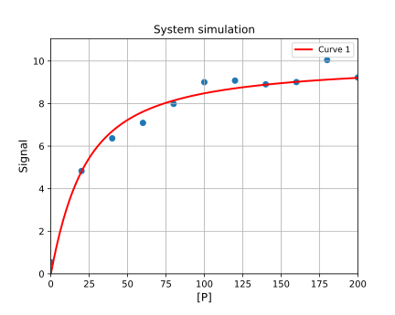

# Fitting of data to 1:1 binding


[Return to tutorials](tutorial.md)
 
Example code is available here: [https://github.com/stevenshave/pybindingcurve/blob/master/example_1to1_fit.py](https://github.com/stevenshave/pybindingcurve/blob/master/example_1to1_fit.py)

A titration of protein from nothing to 200 µM into a cuvette containing 10 µM ligand produces the following signal from the instrument:

| [P] µM | 0 | 20 |40|60|80|100|120|140|160|180|200|
|---|---|---|---|---|---|---|---|---|---|---|---
| Signal |	54.4|483.2|636.7|709.3|798.7|900.5|907.9|890.6|901.0|1004.6|922.5|

We may easily fit this data using PBC and obtain two values… the KD of the complex, as well as the maximal signal (ymax) achievable with the system.
We first import PBC and Numpy:
```
import numpy as np
import pybindingcurve as pbc
```
Next we create NumPy arrays to hold our protein concentration and signal:
```
xcoords = np.array([0.0, 20.0, 40.0, 60.0, 80.0, 100.0, 120.0, 140.0, 160.0, 180.0, 200.0])
ycoords = np.array([54.4, 483.2, 636.7, 709.3, 798.7, 900.5, 907.9, 890.6, 901.0, 1004.6, 922.5])
```
We now define a PBC BindingCurve object governed by the 1:1 binding system, and add the experimental data to PBC’s internal plot using the add_scatter function of the returned BindingCurve object:
```
mySystem = pbc.BindingCurve("1:1")
mySystem.add_scatter(xcoords, ycoords)
```
When simulating a curve, we define a system with all parameters required to fully describe the simulation.  In this case, we know four things; the amount of protein in the system (xcoords), the concentration of ligand present, the minimal signal, and finally the response.  We supply the amount of protein and ligand, along with the known minimum signal for no protein being present (calculated by calling np.min on ycoords), and not yet the response to define the system which will be supplied as an argument to the fitting function in the next code segment:
```
system_parameters = {"p": xcoords, "l": 10, “ymin”:np.min(ycoords)}
``` 
We then perform the fit, capturing two pieces of data; the fitted system (a dictionary of system parameters best describing the system) and the fit accuracy data.  The call to PBC.BindingCurve.fit takes the known system parameters, followed by the unknown system parameters, and finally the signal data which we are fitting to.  Unknown system parameters are passed in a dictionary, much like the system parameters, but their assigned value is only used as a starting point guess for the fitting routines and can normally be set to any value. A reasonable guess at the true value, however, is good practice. Inclusion of either ymin or ymax as either a known, or unknown system parameters allows PBC to infer that we are fitting to a signal, not an absolute, known complex concentration:
```
fitted_system, fit_accuracy = mySystem.fit(system_parameters, {"kdpl": 0, “ymax”:1000}, ycoords)
```
We may now print out the fitted paramers, along with the accuracy of the parameters. Internally, PBC utilises the lmfit package to return fitted parameters along with a true fit accuracy, specifying a range within which we are 95% certain that the true value is within:
```
for k, v in fit_accuracy.items():
    print(f"Fit: {k}={fitted_system[k]} +/- {v}")
````
Running the above code results in the following output:

> Fit: kdpl=24.720148154934403 +/- 3.800620728975203

> Fit: ymax=1072.308288861583 +/- 34.03937019626566

Indicating that the system’s KD is 24.72 +/- 3.8 µM.

To visualise how well this fit describes the experimental data, we can use the returned system parameters to plot a curve over the scatter data already added to the pbc.BindingCurve object’s internal plot.  However, the returned system object currently looks like this:
> {'p': array([  0.,  20.,  40.,  60.,  80., 100., 120., 140., 160., 180., 200.]), 'l': 10, 'ymin': 54.4, 'kdpl': 24.720148154934403, 'ymax': 1072.308288861583}

Simulating and plotting such a system would produce a plot with only 11 points along the x-axis and would  not look correct.  We therefore increase the number of points present for protein concentration with the following command:
```
fitted_system["p"] = np.linspace(0, np.max(xcoords))
```
We may then add the curve to the plot and visualise the result.
```
mySystem.add_curve(fitted_system)
mySystem.show_plot()
```
Resulting in the following:



[Return to tutorials](tutorial.md)
