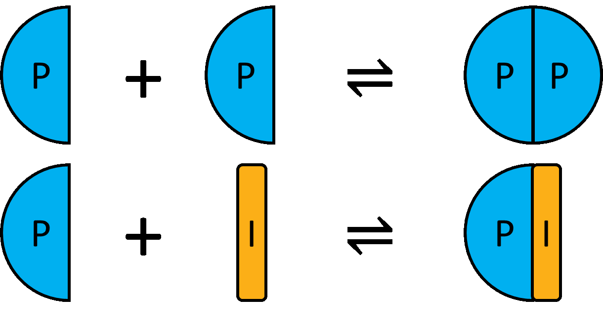
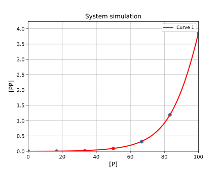

# Fitting of data to homodimer formation


[Return to tutorials](tutorial.md)

Using experimental competition data, we may obtain system parameters, such as dimerisation KD. Example code is available here: [https://github.com/stevenshave/pybindingcurve/blob/master/example_homodimer_formation_fit.py](https://github.com/stevenshave/pybindingcurve/blob/master/example_homodimer_formation_fit.py)
Perform the standard imports:
```
import numpy as np
import pybindingcurve as pbc
```
We can choose to work in a common unit, typically nM, or µM, as long as all numbers are in the same unit, the result is valid.  We assume µM for all concentrations bellow:

Define experimental data:
```
xcoords = np.array([0.0, 16.7, 33.3, 50.0, 66.7, 83.3, 100.0])
ycoords = np.array([0.0, 0.004, 0.021, 0.094, 0.312, 1.188, 3.854])
```
Construct the PyBindingCurve object, operating on a homodimer breaking system and add experimental data to the plot:
```
my_system = pbc.BindingCurve("homodimerbreaking")
my_system.add_scatter(xcoords, ycoords)
```
Known system parameters, kdpl will be added to this by fitting:

```
system_parameters = {"p": xcoords, "i": 100, "kdpp": 10}
```
Now we call fit, passing the known parameters, followed by a dict of parameters to be fitted along with an initial guess, pass the ycoords, and what the readout (ycoords) is:
```
fitted_system, fit_accuracy = my_system.fit(system_parameters, {"kdpi": 0}, ycoords)
```
Print out the fitted parameters:
```
for k, v in fit_accuracy.items():
    print(f"Fit: {k}={fitted_system[k]} +/- {v}")
```
Assign more points to 'p' to make a smooth plot:
```
fitted_system["p"] = np.linspace(0, np.max(xcoords))
```
Add a new curve, simulated using fitted parameters to our BindingCurve object and display the plot:
```
my_system.add_curve(fitted_system)
my_system.show_plot()
```
Resulting in:
> Fit: kdpi=1.0024780308947485 +/- 0.001698935583536732




[Return to tutorials](tutorial.md)
