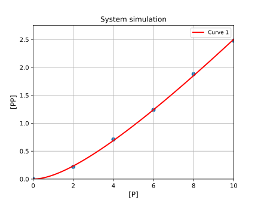

# Fitting of data to homodimer formation


[Return to tutorials](tutorial.md)

Using experimental competition data, we may obtain system parameters, such as dimerisation KD. Example code is available here: [https://github.com/stevenshave/pybindingcurve/blob/master/example_homodimer_formation_fit.py](https://github.com/stevenshave/pybindingcurve/blob/master/example_homodimer_formation_fit.py)
Perform the standard imports:

```python
import numpy as np
import pybindingcurve as pbc
```

We can choose to work in a common unit, typically nM, or µM, as long as all numbers are in the same unit, the result is valid.  We assume µM for all concentrations bellow.

We define the known experimental data bellow:

```python
xcoords = np.array([0.0,2,4,6,8,10])
ycoords = np.array([0., 0.22, 0.71, 1.24,1.88,2.48])
```

Construct the PyBindingCurve object, operating on a homodimer formation system and add experimental data to the plot:

```python
mySystem = pbc.BindingCurve("homodimer formation")
mySystem.add_scatter(xcoords, ycoords)
```

Known system parameters, kdpp will be added to this by fitting:

```python
system_parameters = {"p": xcoords}
```

Now we call fit, passing the known parameters, followed by a dict of parameters to be fitted along with an initial guess, pass the ycoords, and what the readout (ycoords) is:

```python
fitted_system, fit_accuracy = mySystem.fit(system_parameters, {"kdpp": 0}, ycoords)
```

Print out the fitted parameters:

```python
for k, v in fit_accuracy.items():
    print(f"Fit: {k}={fitted_system[k]} +/- {v}")
```

Producing:
> Fit: kdpp=9.939776196471206 +/- 0.15729785759220752
    

Assign more points to 'p' to make a smooth plot:

```python
fitted_system["p"] = np.linspace(0, np.max(xcoords))
```

Add a new curve, simulated using fitted parameters to our BindingCurve object and show the plot:

```python
mySystem.add_curve(fitted_system)
mySystem.show_plot()
```

Producing:



[Return to tutorials](tutorial.md)
