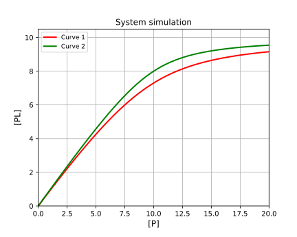
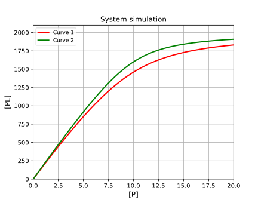
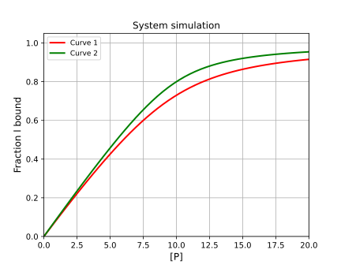

# Simulation of 1:1 binding and exploration of all options

[Return to tutorials](tutorial.md)
 
Example code is available here: [https://github.com/stevenshave/pybindingcurve/blob/master/example_1to1_simulation.py](https://github.com/stevenshave/pybindingcurve/blob/master/example_1to1_simulation.py)

A 1:1 binding system typically consists of a protein and a ligand. However, this 1:1 system is suitable for simulation of any two different species forming a complex. This system can therefore be used to simulate hetero-dimer formation, where two different proteins form a complex. In this simple example, we will imagine wanting to know the concentration of a complex formed. We can choose to work in a common unit, typically nM, or µM, as long as all numbers are in the same unit, the result is valid.  We assume µM for all concentrations and KDs bellow.

First, we may want to produce a plot of protein vs complex concentration for a fixed amount of ligand, simulating the titration of protein into a cuvette for example. We must import PyBindingCurve and NumPy, and then make a new BindingCurve object which takes as an argument the type of system that should be represented. In this case “1:1” will define the correct system. For a list of all systems, please see “pbc.systems and shortcut strings” in the PyBindingCurve documentation.
```python
import numpy as np
import pybindingcurve as pbc
my_system = pbc.BindingCurve("1:1")
```
We then define the system parameters in a python dictionary, defining p (protein concentration) as a linear NumPy sequence from 0 to 20 µM, l (ligand concentration) as 10 µM, and the protein-ligand KD to be 1 µM.
```python
system_parameters = {"p": np.linspace(0, 20), "l": 10, "kdpl": 1}
```
We can now add the curve to the plot. If we want multiple simulations on the same plot, then it is good to give the curve a name with the optional name parameter.
```python
my_system.add_curve(system_parameters, name= “Curve 1”)
```
Now we add another, higher affinity curve to the plot, defining a similar system with a lower KD and add it to the curve.
```python
system_parameters_higher_affinity = {"p": np.linspace(0, 20), "l": 10, "kdpl": 0.5}
my_system.add_curve(system_parameters_higher_affinity, name “Curve 2”)
```

Finally show the plot.  Optionally, title, xlabel and ylabel variables may also be passed to title the plot and axes.
```python
my_system.show_plot()
```
This produces the following plot:

 
To obtain exact single points from the plot, we may call the query function of my_system:
```python
print(my_system.query({“p”:5, “l”:10, “kdpl”:1})
```
If a list or NumPy array is included as a system parameter, then a NumPy array of results is returned.

We may want to simulate a system in terms of a signal, not the concentration of complex.  In this case, we may pass additional parameters, setting the ymax and/or ymin variables in the system parameters.  Inclusion of these will scale the signal present between these values.  This is very important if a detector is used with a maximum or minimum sensitivity and you wish to simulate response. Changing our system parameters to include a maximal response of 2000 units will result in subtle scale and axes changes:
```python
system_parameters = {"p": np.linspace(0, 20), "l": 10, "kdpl": 1, 'ymax':2000}
system_parameters_higher_affinity = {"p": np.linspace(0, 20), "l": 10, "kdpl": 0.5, 'ymax':2000}
my_system.add_curve(system_parameters, name= “Curve 1”)
my_system.add_curve(system_parameters_higher_affinity, name= “Curve 2”)
my_system.show_plot()
```
Resulting in the following:


Additionally, we may transform the readout by passing a range of pbc.Readout objects to add_curve, or query. To display curves as a fraction total ligand bound, we would pass pbc.Readout.fracion_l.  For more information on readouts, please see pbc.Readout in the PyBindingCurve documentation. Supplying a readout overrides the automatic signal readout selection when a ymin or ymax parameter has been found in a system:
```python
system_parameters = {"p": np.linspace(0, 20), "l": 10, "kdpl": 1, 'ymax':2000}
system_parameters_higher_affinity = {"p": np.linspace(0, 20), "l": 10, "kdpl": 0.5, 'ymax':2000}
my_system.add_curve(system_parameters, readout=pbc.Readout.fraction_l)
my_system.add_curve(system_parameters_higher_affinity, readout=pbc.Readout.fraction_l)
my_system.show_plot() 
```
Results in the following:



[Return to tutorials](tutorial.md)