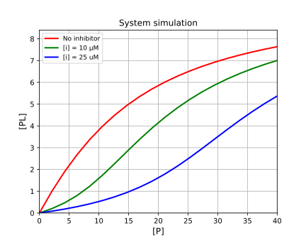

# 1:1:1 competition simulation

[Return to tutorials](tutorial.md)
Competition is often used in assays, utilising displacement of a labelled ligand by new inhibitor to detect competitive binding and displacement of the label.  Example code is available here: 
https://github.com/stevenshave/pybindingcurve/blob/master/example_competition_simulation.py
 
First perform imports:
```
import numpy as np
import pybindingcurve as pbc
```
We can choose to work in a common unit, typically nM, or µM, as long as all numbers are in the same unit, the result is valid.  We assume µM for all concentrations bellow.

Create the PBC BindingCurve object, governed by a 'competition' system:
```
mySystem = pbc.BindingCurve("competition")
```
First, let’s simulate a curve with no inhibitor present (essentially 1:1)

```
mySystem.add_curve(p": np.linspace(0, 40, 20), "l": 10, "i": 0, "kdpi": 1, "kdpl": 10}, "No inhibitor")
```
Add curve with inhibitor (i):
```
mySystem.add_curve(
    {"p": np.linspace(0, 40, 20), "l": 10, "i": 10, "kdpi": 1, kdpl": 10}, "[i] = 10 µM"
)
```

Add curve with more inhibtor (i):
```
mySystem.add_curve(
    {"p": np.linspace(0, 40, 20), "l": 10, "i": 25, "kdpi": 1, "kdpl": 10}, "[i] = 25 µM"
)
```
Display the plot:
```
mySystem.show_plot()
```
Which results in the following:




[Return to tutorials](tutorial.md)