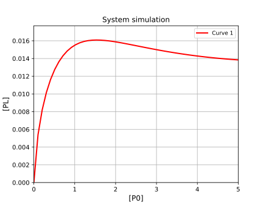

# Simulation of custom binding systems

[Return to tutorials](tutorial.md)
 
Example code is available here: [https://github.com/stevenshave/pybindingcurve/blob/master/example_custom_binding_system.py](https://github.com/stevenshave/pybindingcurve/blob/master/example_custom_binding_system.py)

Using Lagrange multipliers as a method of solving protein-ligand binding systems, PyBindingCurve is able to write custom Lagrangian functions from very simple system definition strings.  This allows the simple definition, solving, plotting and fitting to any custom system.

We define these custom systems as simple strings with reactions separated either on newlines, commas, or a combination of the two.  Reactions take the form:

- r1+r2<->p

Denoting reactant1 + reactant2 form p.

PBC will generate and solve custom Lagrangian systems. Readouts are signified by inclusion of a star (*) on a species.  If no star is found, then the first seen product is
used. Some system examples follow:
- "P+L<->PL" - standard protein-ligand binding
- "P+L<->PL, P+I<->PI" - competition binding
- "P+P<->PP" - dimer formation (default readout on PP - dimer)
- "P*+P<->PP" - dimer formation (readout specified on P - monomer)
- "monomer+monomer<->dimer" - dimer formation (default readout on PP)
- "P+L<->PL1, P+L<->PL2, PL1+L<->PL1L2, PL2+L<->PL1L2" - 1:2 site binding

KDs passed to custom systems use underscores to separate species. P+L<->PL
would require the KD passed as kd_p_l. Running with incomplete system
parameters will prompt for the correct ones.

We can choose to work in a common unit, typically nM, or µM, as long as all numbers are in the same unit, the result is valid.  We assume µM for all concentrations and KDs bellow.

To simulate a highly complex system, where protein binds to ligand, but protein can dimerise, while protein dimer binds to an inhibitor, and the protein dimer has can bind a single ligand, and our readout is on the protein monomer bound to ligand, we would define the system as follows:

```python
custom_system="""
       P+L<->PL*
        P+P<->PP
        PP+I<->PPI
        PPI+L<->PPIL
"""
```
We can simulate this system in Python as follows:

```python
import numpy as np
import pybindingcurve as pbc
custom_system="""
        P+L<->PL*
        P+P<->PP
        PP+I<->PPI
        PPI+L<->PPIL
"""
my_system = pbc.BindingCurve(custom_system)
```

We then define the system parameters in a python dictionary.

```python
system_parameters = {'p0': np.linspace(0,5), 
'l0':0.5,
'i0':4.0,
'kd_p_l':1,
'kd_p_p':2,
'kd_p_p':1.2,
'kd_p_l':4.3,
'kd_pp_i':1.2,
'kd_ppi_l':0.2,
}
```
We can now add the curve to the plot. If we want multiple simulations on the same plot, then it is good to give the curve a name with the optional name parameter.
```python
my_system.add_curve(system_parameters, name= “Curve 1”)
```

Finally show the plot.  Optionally, title, xlabel and ylabel variables may also be passed to title the plot and axes.
```python
my_system.show_plot()
```
This produces the following plot:

 
To obtain exact single points from the plot, we may call the query function of my_system:
```python
print(my_system.query({'p0': 0.5, 
'l0':0.5,
'i0':4.0,
'kd_p_l':1,
'kd_p_p':2,
'kd_p_p':1.2,
'kd_p_l':4.3,
'kd_pp_i':1.2,
'kd_ppi_l':0.2,
})
```
If a list or NumPy array is included as a system parameter, then a NumPy array of results is returned.

We may want to simulate a system in terms of a signal, not the concentration of complex.  In this case, we may pass additional parameters, setting the ymax and/or ymin variables in the system parameters.  Inclusion of these will scale the signal present between these values.  This is very important if a detector is used with a maximum or minimum sensitivity and you wish to simulate response. 

[Return to tutorials](tutorial.md)