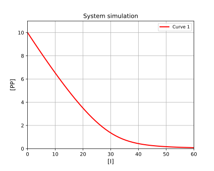

# Simulation of homodimer breaking

[Return to tutorials](tutorial.md)

Homodimer breaking is like a competition experiment, however breaking of the dimer results in two monomers. Example code is available here: [https://github.com/stevenshave/pybindingcurve/blob/master/example_homodimer_formation_simulation.py](https://github.com/stevenshave/pybindingcurve/blob/master/example_homodimer_formation_simulation.py)

First, we perform the standard imports:
```
import numpy as np
import pybindingcurve as pbc
```
We can choose to work in a common unit, typically nM, or µM, as long as all numbers are in the same unit, the result is valid.  We assume µM for all concentrations bellow.  Define out homodimer breaking system, titrating in inhibitor:
```
system_parameters = {"p": 30, "kdpp": 10, "i": np.linspace(0,60), "kdpi": 1}
```

Create the PBC BindingCurve object, expecting a 'homodimer breaking' system:
```
my_system = pbc.BindingCurve("homodimer breaking")
```
Add the system to PBC, generating a plot and display it:
```
my_system.add_curve(system_parameters)
my_system.show_plot()
```
Resulting in:



[Return to tutorials](tutorial.md)