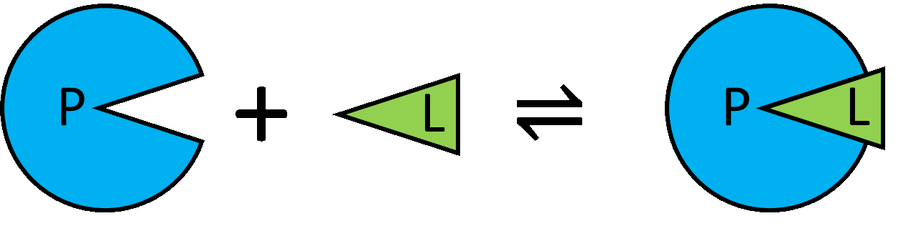
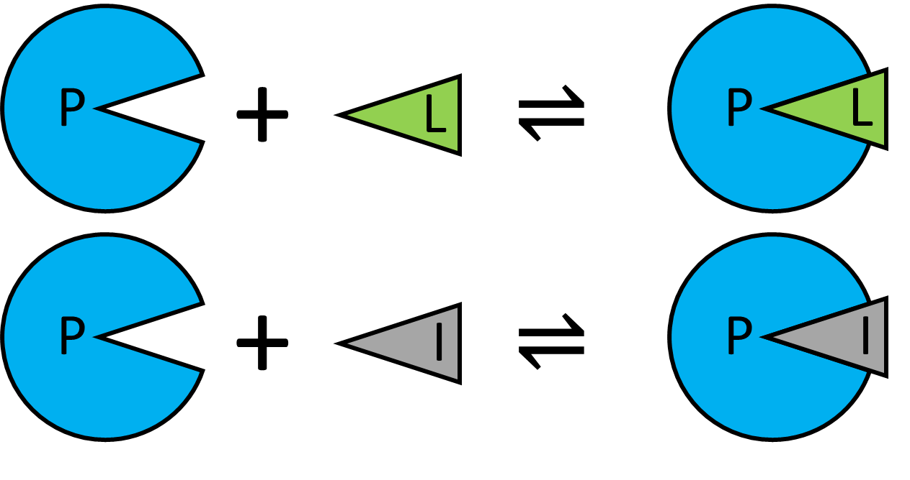
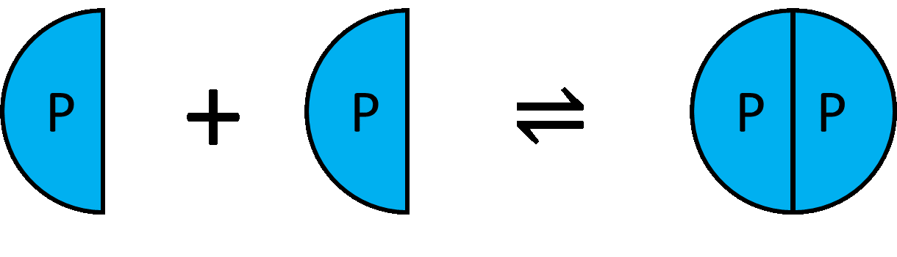

# PyBindingCurve tutorials
The following pages contain tutorials for simulation and fitting to a number of different systems.  The most extensive, with most explanation is simple 1:1 simulation and fitting.  Tutorials for the following systems are available:

## 1:1

 - [Simulation](simulate_1to1.md)
 - [Fitting](fit_1to1.md)

## 1:1:1 Competition

 - [Simulation](simulate_competition.md)
 - [Fitting](fit_competition.md)

## Homodimer formation

 - [Simulation](simulate_homodimerformation.md)
 - [Fitting](fit_homodimerformation.md)

## Homodimer breaking

 - [Simulation](simulate_homodimerbreaking.md)
 - [Fitting](fit_homodimerbreaking.md)

[Return to main site](Readme.md)